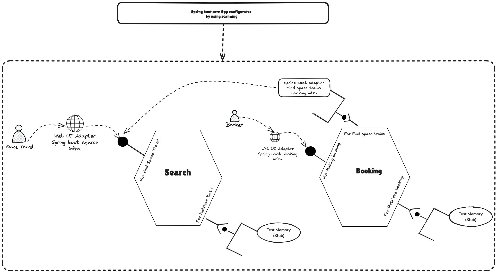

# Hive Pattern In Java 11
It's about my understanding of hexagonal architecture, based on the work of Julien Julien Topçu.
I don't own the demo. And I haven't tested all the concepts he'd like to demonstrate.
Thanks to my pair programming assistants Claude AI, Vercel AI, ChatGPT.

The code could certainly be improved.  The main objective was to understand the concepts demonstrated by:
* DDD by Eric Evans
* Port Adapter/Hexagonal Architecture Alistair Cockburn, Juan Manuel Garrido de Paz


You can find original source in kotlin to [Hexagonal Architecture](https://gitlab.com/beyondxscratch/hive-pattern).


## My understanding of architecture
### Hive with clients, driving/driven, configurators

### Hived modular monolith implementation

In the Hive, each bounded-context having domain services are implemented using modules having hexagons. This kind of module have a domain sub-module (hexagon containing the business logic and the ports), and the infrastructure containing the adapters.
Modular Monolith developed with the Hive pattern follows a vertical slicing.

To illustrate that, the backend is divided into several modules:
```
mandalore-express-money
    Generic sub-domain containing only value objects. Basically a library without ports and adapters.
mandalore-express-search
    Core domain exposing search domain services (features).
mandalore-express-booking
    Core domain exposing booking domain services (features).
mandalore-express-annotations
    Trick to invert the dependency between the domains and the dependency injection framework (here Spring).
mandalore-express-hypermedia
    Technical module which allows controllers of each module to serialize links to external resources.
mandalore-express-composition-root
    Composition Root which assembles the application. It builds the context for dependency injection frameworks. 
    Basically in Spring-based application, this is where you'll find the SpringBootApplication.  
```


## Requirements

`maven 3.8.3`, `Java JDK11`.

## Backend

Build:
```bash
cd backend
mvn clean install
```

Launch:
```bash
cd  backend/src/mandalore-express-composition-root/
mvn spring-boot:run
```


## Frontend
Visit the repository [Hive Repository](https://gitlab.com/beyondxscratch/hive-pattern)


